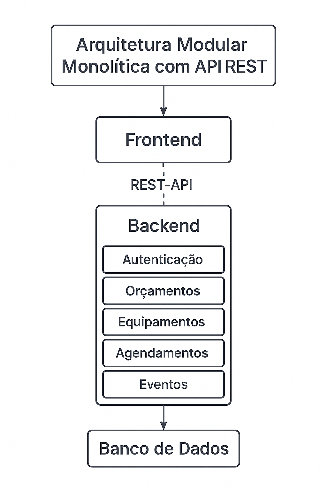

Optamos por uma arquitetura modular monolítica com API REST para o MVP da solução da Reflex Som devido a uma combinação de simplicidade, rapidez de entrega e facilidade de manutenção, características essenciais em fases iniciais de produto.  Abaixo os principais motivos da escolha:

## 1. Baixa Complexidade Inicial

A arquitetura monolítica permite o desenvolvimento e a implantação de toda a aplicação como um único pacote, o que reduz significativamente a complexidade técnica para o time inicial, agilizando a entrega.

---

## 2. Estrutura Modular para Organização

Mesmo sendo monolítico, o sistema é dividido em módulos bem definidos (autenticação, orçamentos, equipamentos, agendamentos, eventos), o que facilita a leitura do código, testes, manutenção e futura expansão do sistema.

---

## 3. API RESTful

A adoção de uma API REST padroniza a comunicação entre o frontend (cliente, admin) e o backend, permitindo que o frontend evolua de forma independente e até seja reutilizado em outros canais (ex: aplicativo mobile no futuro).

---

## 4. Facilidade de Evolução

A modularização interna deixa o projeto preparado para uma eventual migração futura para microsserviços, se a demanda da empresa crescer. Os contratos de API já estarão definidos, facilitando essa transição.

--- 

## 5. Custo reduzido de infraestrutura
Como tudo é executado dentro de uma única aplicação, os requisitos de infraestrutura são menores, permitindo o uso de hospedagens mais acessíveis (ex: VPS, Heroku, Render, Railway).

---

Essa escolha foi feita com foco em viabilidade de curto prazo e flexibilidade para crescimento, garantindo que a Reflex Som possa validar rapidamente seu produto, entregar valor e planejar escalabilidade com base em dados reais de uso.

---

