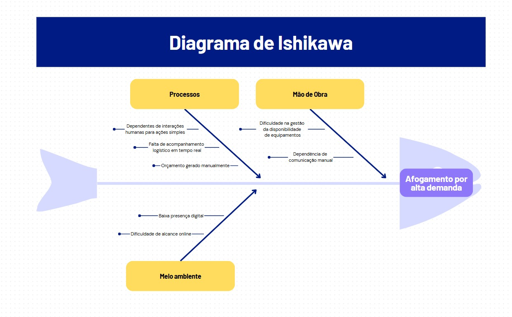

# Cenário Atual do Cliente e do Negócio

## Introdução ao Negócio e Contexto

A Reflex Som é uma empresa com sede em Brasília (DF) especializada na locação e venda de equipamentos de som, iluminação e efeitos especiais para eventos. Com mais de três décadas de atuação, a empresa trabalha em projetos de pequeno, médio e grande porte, atendendo tanto o setor público quanto o privado. Seu portfólio abrange desde festas particulares até grandes eventos institucionais, como lançamentos de empreendimentos e celebrações diplomáticas. A Reflex Som oferece soluções técnicas e equipamentos modernos, como sky walkers, low fog (gelo seco), máquinas de neve e bolhas, entre outros. Seu público-alvo é formado por pessoas físicas e jurídicas que organizam e promovem eventos.

## Identificação da Oportunidade ou Problema

Com o crescimento do setor de eventos e a busca por experiências mais elaboradas, a Reflex Som identifica uma oportunidade estratégica: modernizar sua presença digital e operacional, centralizando orçamentos, catálogos de equipamentos e atendimento técnico em uma plataforma integrada. Atualmente, muitos processos, como a elaboração de orçamentos, a consulta de catálogo de equipamentos e o agendamento e atendimento técnico, ainda são realizados de forma manual ou dependem fortemente de interações diretas, o que pode impactar a agilidade do negócio, principalmente em datas de alta demanda.

## Desafios do Projeto

Os principais desafios enfrentados pela Reflex Som envolvem:

- Dificuldade na gestão da disponibilidade de equipamentos, principalmente em períodos com múltiplos eventos simultâneos.

- Falta de presença online estruturada, com resposta eficiente ao cliente e visualização clara dos serviços.

- Acompanhamento técnico e logístico das operações em tempo real, o que é essencial para garantir a eficiência nos eventos.

## Segmentação de Clientes

A Reflex Som atende a um público variado, que pode ser segmentado em diferentes perfis:

- Noivos, debutantes e aniversariantes: indivíduos que estão organizando celebrações pessoais e desejam tornar o evento mais especial com o uso de iluminação, som e efeitos visuais.

- Pais e responsáveis por festas infantis: procuram por efeitos lúdicos, como máquinas de bolhas, neve artificial e iluminação colorida, para criar experiências mágicas para crianças.

- Produtores culturais e artistas independentes: pessoas envolvidas com shows, apresentações teatrais e performances que buscam recursos técnicos como luzes cênicas, fumaça e efeitos especiais para enriquecer o espetáculo.

- Influenciadores digitais e criadores de conteúdo: pessoas que desejam alugar equipamentos para montar estruturas temporárias de gravação, lives ou eventos promocionais, buscando impacto visual e qualidade técnica.
