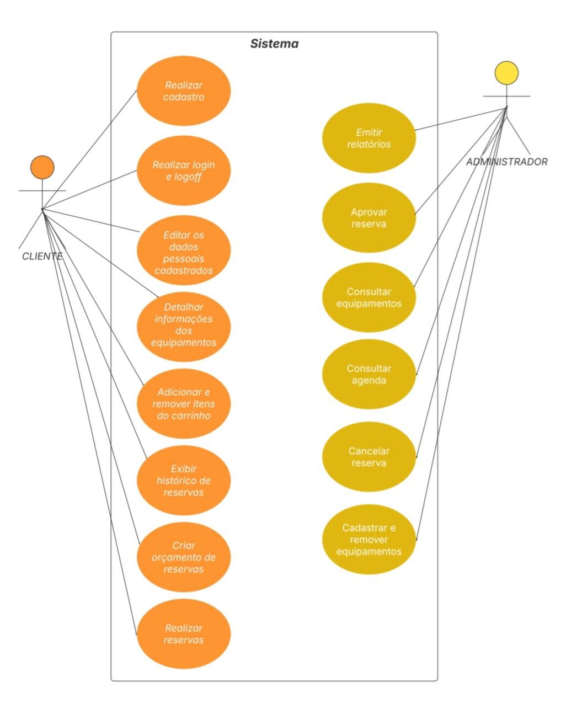
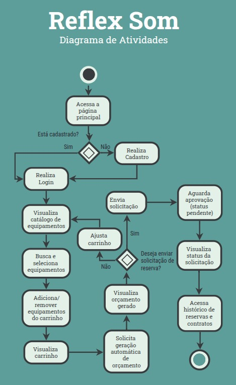

# Casos de Usos

## Especificação de Caso de Uso: Realizar cadastro de cliente

**Personna:** Cliente

### 1. Breve Descrição
Este caso de uso permite que novos clientes realizem o cadastro na plataforma da Reflex Som, fornecendo seus dados pessoais e criando uma conta de acesso. Após o cadastro, o cliente poderá acessar funcionalidades como solicitar orçamentos e reservar equipamentos.

### 2. Fluxo Básico de Eventos com Regras Relacionadas

1. O cliente acessa a página inicial da plataforma.
2. O cliente clica na opção "Cadastrar-se".
3. O sistema exibe o formulário de cadastro.
4. O cliente preenche os seguintes campos obrigatórios:
    - Nome completo
    - CPF ou CNPJ  
      > (↳ ver **RN003** – Validação de CPF/CNPJ)
    - E-mail
    - Telefone
    - Senha
    - Confirmação de senha  
      > (↳ ver **RN001** – Validação de campos obrigatórios)
5. O cliente clica no botão "Concluir Cadastro".
6. O sistema valida os dados informados.  
   > (↳ ver **RN002** – Validação de formato de e-mail e senha)  
   > (↳ ver **FA2** – Campos obrigatórios não preenchidos ou inválidos)
7. O sistema verifica se já existe uma conta com o CPF/CNPJ ou e-mail informado.  
   > (↳ ver **FA1** – Conta já cadastrada)  
   > (↳ ver **RN004** – Cadastro único por CPF/CNPJ e e-mail)
8. O sistema salva os dados no banco.  
   > (↳ ver **FE1** – Erro interno ao salvar os dados)
9. O sistema exibe mensagem de sucesso.
10. O caso de uso é encerrado.

### 3. Fluxos Alternativos

**FA1 – Conta já cadastrada com o mesmo CPF/CNPJ ou e-mail (↳ passo 7)**

1. O fluxo alternativo inicia no passo 7 do fluxo principal.
2. O sistema informa que já existe uma conta cadastrada com os dados informados.
   > (↳ ver **RN004** – Cadastro único por CPF/CNPJ e e-mail)
3. O sistema exibe a mensagem "Tente novamente com outro e-mail/CPF".
4. O fluxo retorna ao passo 3.

**FA2 – Campos obrigatórios não preenchidos ou inválidos (↳ passo 6)**

1. O fluxo alternativo inicia no passo 6.
2. O sistema identifica que há campos obrigatórios em branco ou com dados inválidos.
   > (↳ ver **RN001** – Campos obrigatórios)
3. O sistema exibe mensagens de erro específicas por campo.
4. O cliente corrige os campos.
5. O fluxo retorna ao passo 5.

### 4. Fluxo de Exceção

**FE1 – Erro interno ao salvar os dados (↳ passo 8)**

1. O fluxo de exceção inicia no passo 8.
2. O sistema não consegue salvar os dados por erro de conexão ou banco.
3. O sistema exibe uma mensagem de erro geral.
4. O cliente pode tentar novamente ou contatar o suporte.
5. O fluxo é encerrado.

### 5. Pré-Condições

- O cliente ainda não possui cadastro na plataforma.
- O cliente tem acesso à internet e ao site da Reflex Som.

### 6. Pós-Condições

- Uma nova conta é criada e salva no banco de dados.
- O cliente pode efetuar login com as credenciais recém-criadas.

### 7. Regras de Negócio

**RN001** – Todos os campos marcados como obrigatórios devem ser preenchidos.

**RN002** – O e-mail deve ser válido e a senha deve conter no mínimo 8 caracteres, incluindo letra maiúscula, número e caractere especial.

**RN003** – CPF ou CNPJ devem ser válidos conforme algoritmos de verificação.

**RN004** – Não deve ser permitido cadastro duplicado para o mesmo e-mail ou CPF/CNPJ.

---

## Especificação de Caso de Uso: Realizar login do Cliente

**Persona:** Cliente

### 1. Breve Descrição
Este caso de uso permite que um cliente com cadastro ativo na Reflex Som acesse a plataforma utilizando suas credenciais (e-mail e senha). Após o login bem-sucedido, o cliente será redirecionado para sua área pessoal, onde poderá visualizar o catálogo, solicitar orçamentos e gerenciar reservas.

### 2. Fluxo Básico de Eventos

1. O cliente acessa a página inicial da plataforma.
2. O cliente clica na opção "Entrar".
3. O sistema exibe o formulário de login com os campos:
    - E-mail
    - Senha
4. O cliente preenche os campos e clica em "Acessar".  
   > Ver **RN001** – Campos obrigatórios
5. O sistema valida os campos preenchidos.  
   > Ver **RN002** – Validação de formato de e-mail
6. O sistema verifica se as credenciais são válidas.  
   > Ver **FA1** – Credenciais inválidas  
   > Ver **RN003** – Verificação de autenticação
7. O sistema autentica o cliente e inicia uma sessão.
8. O sistema redireciona o cliente para a área logada.
9. O caso de uso é encerrado.

### 3. Fluxos Alternativos

**FA1 – Credenciais inválidas (↳ passo 6)**

1. O fluxo alternativo inicia no passo 6.
2. O sistema informa que o e-mail ou a senha estão incorretos.
3. O sistema exibe novamente o formulário de login.
4. O cliente pode tentar novamente.  
5. O fluxo retorna ao passo 3.

**FA2 – Campos obrigatórios não preenchidos (↳ passo 5)**

1. O fluxo alternativo inicia no passo 5.
2. O sistema identifica que um ou mais campos estão em branco.
3. O sistema exibe uma mensagem de erro indicando os campos obrigatórios.
4. O cliente corrige os campos.
5. O fluxo retorna ao passo 4.  
   > Ver **RN001**

### 4. Fluxos de Exceção

**FE1 – Erro interno ao autenticar (↳ passo 6 ou 7)**

1. O sistema tenta autenticar o cliente, mas ocorre uma falha técnica (ex: indisponibilidade do banco de dados).
2. O sistema exibe uma mensagem genérica de erro: "Erro ao tentar acessar. Tente novamente mais tarde."
3. O cliente é mantido na tela de login.
4. O fluxo é encerrado.

### 5. Pré-Condições
- O cliente já deve estar cadastrado na plataforma.
- O cliente está na página pública da Reflex Som.

### 6. Pós-Condições
- Uma sessão autenticada é iniciada.
- O cliente tem acesso aos recursos da área logada.

### 7. Regras de Negócio

**RN001 – Campos obrigatórios** 

- Referente ao passo 4 e FA2  
- Os campos e-mail e senha são obrigatórios para login.

**RN002 – Validação de e-mail**  

- Referente ao passo 5  
- O e-mail deve seguir o formato válido: exemplo@dominio.com.

**RN003 – Verificação de autenticação**  

- Referente ao passo 6  
- As credenciais devem ser verificadas contra os dados armazenados no banco. Senhas devem ser comparadas de forma criptografada (hash seguro, ex: bcrypt).

---

## Especificação de Caso de Uso: Realizar logoff

**Persona:** Cliente

### 1. Breve Descrição

Este caso de uso permite que um cliente autenticado encerre sua sessão ativa na plataforma, retornando à página inicial. O logoff garante que o acesso às funcionalidades protegidas seja bloqueado até novo login.

### 2. Fluxo Básico de Eventos

1. O cliente encontra-se logado na plataforma.
2. O cliente clica no ícone do perfil localizado no topo da tela.
3. O sistema exibe um menu suspenso com a opção “Sair”.
4. O cliente clica na opção **"Sair"**.
5. O sistema encerra a sessão autenticada.  
   > Ver **RN001 – Encerramento de sessão**  
   > Ver **FE1 – Erro ao encerrar sessão**
6. O sistema redireciona o cliente para a página inicial da plataforma.
7. O caso de uso é encerrado.

### 4. Fluxos de Exceção

**FE1 – Erro ao encerrar sessão (↳ passo 5)**

4.1.1 O fluxo de exceção inicia no passo 5 do fluxo principal.  
4.1.2 O sistema encontra uma falha ao encerrar a sessão (ex: token inválido ou falha de comunicação).  
4.1.3 O sistema exibe uma mensagem de erro genérica: "Não foi possível encerrar a sessão. Tente novamente."  
4.1.4 O cliente permanece na mesma página.  
4.1.5 O fluxo é encerrado.

### 5. Pré-Condições

- O cliente deve estar autenticado na plataforma.
- O sistema deve estar operacional.

### 6. Pós-Condições

- A sessão autenticada é encerrada.
- O cliente é tratado como visitante e não pode acessar funcionalidades restritas.

### 7. Regras de Negócio

**RN001 – Encerramento de sessão**

- Referente ao passo 5 do fluxo básico
- Referente também ao FE1
- O sistema deve eliminar o token de autenticação da sessão (ex: JWT ou sessão em cache) e garantir que o cliente seja tratado como visitante.

---

# Diagrama de Atividades

