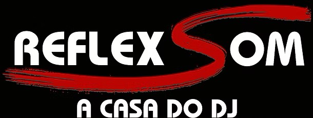

# Reflex Som

# Introdução

O projeto Reflex Som é um projeto desenvolvido durante o semestre 2025.1 na disciplina de Requisitos de Software na FTCE - UnB. O foco do projeto é impactar a agilidade do negócio e modernizar seu contato com o cliente. Para mais informações, consulte a Visão de Produto e Projeto.

# Equipe - Team 7

<table style="text-align: center;">
  <tr>
    <td><strong>Mateus de Castro Santos</strong></td>
    <td><strong>Davi Mesquita Sousa</strong></td>
    <td><strong>André Gustavo Rabelo do Nascimento</strong></td>
  </tr>
  <tr>
    <td></td>
    <td></td>
    <td></td>
  </tr>
  <tr>
    <td><strong>Ana Luiza Komatsu Aroeira</strong></td>
    <td><strong></strong></td>
    <td><strong>Maria Clara Alves de Sousa</strong></td>
  </tr>
  <tr>
    <td></td>
    <td></td>
    <td></td>
  </tr>
</table>

---

# Histórico de Revisão

| Data        | Versão | Descrição                                                                 | Autor   |
|-------------|--------|---------------------------------------------------------------------------|---------|
| 19/04/2025  | 1.0    | Criação            | Grupo   |
| 21/04/2025  | 1.1    | Adicionando informações sobre Visão de  Produto         | Grupo   |
| 10/05/2025  | 1.2    | Alterações em informações na seção Visão do Produto  | Grupo  |
| 13/05/2025  | 1.3    | Adição do submódulo de Engenharia de Requisitos  | André, Mateus e Davi  |

