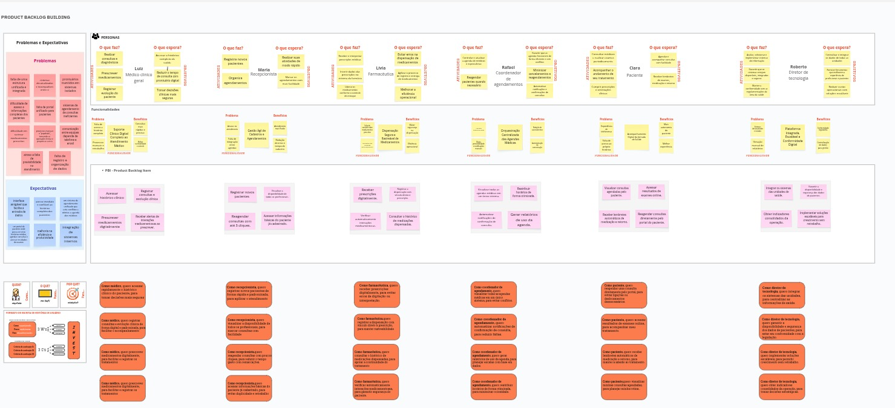

# Exercício de construção do backlog usando o Product Backlog Building (PBB)

Utilizamos o Product Backlog Building (PBB) para construir o Product Backlog da HealthNet, uma rede abrangente de clínicas e hospitais distribuídos por diversos estados, que atualmente enfrenta desafios significativos na gestão integrada de seus dados e processos clínicos.

---

<iframe width="768" height="432" src="https://miro.com/app/live-embed/uXjVIlHH_H4=/?embedMode=view_only_without_ui&moveToViewport=-9003,-3717,12903,5969&embedId=824749818465" frameborder="0" scrolling="no" allow="fullscreen; clipboard-read; clipboard-write" allowfullscreen></iframe>

---

[Abrir PDF](arquivos/PBB.pdf)

---

## Backlog de Produto

| Nº   | História de Usuário                                                                                                                                       | Épico                                                                                      |
|------|-----------------------------------------------------------------------------------------------------------------------------------------------------------|--------------------------------------------------------------------------------------------|
| US01 | Como doutor, quero acessar rapidamente o histórico clínico do paciente, para tomar decisões mais seguras.                                                | 1. Suporte Clínico Digital Completo ao Atendimento Médico                                 |
| US02 | Como doutor, quero registrar consultas e evolução clínica de forma digital e padronizada, para facilitar o acompanhamento.                              | 1. Suporte Clínico Digital Completo ao Atendimento Médico                                 |
| US03 | Como doutor, quero prescrever medicamentos digitalmente, para facilitar e registrar os tratamentos.                                                      | 1. Suporte Clínico Digital Completo ao Atendimento Médico                                 |
| US04 | Como doutor, quero receber alertas de interações medicamentosas ao prescrever, para evitar riscos ao paciente.                                          | 1. Suporte Clínico Digital Completo ao Atendimento Médico                                 |
| US05 | Como recepcionista, quero registrar novos pacientes de forma rápida e padronizada, para agilizar o atendimento.                                         | 2. Gestão Ágil de Cadastros e Agendamentos                                                |
| US06 | Como recepcionista, quero visualizar a disponibilidade de todos os profissionais, para marcar consultas com facilidade.                                 | 2. Gestão Ágil de Cadastros e Agendamentos                                                |
| US07 | Como recepcionista, quero reagendar consultas com poucos cliques, para reduzir o tempo gasto com remarcações.                                           | 2. Gestão Ágil de Cadastros e Agendamentos                                                |
| US08 | Como recepcionista, quero acessar informações básicas do paciente já cadastrado, para evitar duplicidade e retrabalho.                                  | 2. Gestão Ágil de Cadastros e Agendamentos                                                |
| US09 | Como farmacêutica, quero receber prescrições digitalmente, para evitar erros de digitação ou interpretação.                                              | 3. Dispensação Segura e Rastreável de Medicamentos                                        |
| US10 | Como farmacêutica, quero registrar a dispensação com vínculo direto à prescrição, para manter rastreabilidade.                                          | 3. Dispensação Segura e Rastreável de Medicamentos                                        |
| US11 | Como farmacêutica, quero verificar automaticamente interações medicamentosas, para garantir segurança do paciente.                                      | 3. Dispensação Segura e Rastreável de Medicamentos                                        |
| US12 | Como farmacêutica, quero consultar o histórico de medicações dispensadas, para apoiar a continuidade do tratamento.                                     | 3. Dispensação Segura e Rastreável de Medicamentos                                        |
| US13 | Como coordenador de agendamentos, quero visualizar todas as agendas médicas em um único sistema, para evitar conflitos.                                 | 4. Orquestração Centralizada das Agendas Médicas                                          |
| US14 | Como coordenador de agendamentos, quero reatribuir horários de forma otimizada, para minimizar ociosidade.                                              | 4. Orquestração Centralizada das Agendas Médicas                                          |
| US15 | Como coordenador de agendamentos, quero automatizar notificações de confirmação de consulta, para reduzir faltas.                                       | 4. Orquestração Centralizada das Agendas Médicas                                          |
| US16 | Como coordenador de agendamentos, quero gerar relatórios de uso da agenda, para planejar escalas com base em dados.                                     | 4. Orquestração Centralizada das Agendas Médicas                                          |
| US17 | Como paciente, quero visualizar minhas consultas agendadas, para planejar minha rotina.                                                                  | 5. Acompanhamento Digital da Jornada de Saúde                                             |
| US18 | Como paciente, quero acessar resultados de exames online, para acompanhar meu tratamento.                                                                | 5. Acompanhamento Digital da Jornada de Saúde                                             |
| US19 | Como paciente, quero receber lembretes automáticos de medicação e retorno, para manter a adesão ao tratamento.                                          | 5. Acompanhamento Digital da Jornada de Saúde                                             |
| US20 | Como paciente, quero reagendar uma consulta diretamente pelo portal, para evitar ligações ou deslocamentos desnecessários.                              | 5. Acompanhamento Digital da Jornada de Saúde                                             |
| US21 | Como diretor de tecnologia, quero integrar os sistemas das unidades, para centralizar as informações de saúde.                                          | 6. Plataforma Integrada, Escalável e Conformidade Digital                                 |
| US22 | Como diretor de tecnologia, quero garantir a disponibilidade e segurança dos dados de pacientes, para estar em conformidade com a legislação.           | 6. Plataforma Integrada, Escalável e Conformidade Digital                                 |
| US23 | Como diretor de tecnologia, quero obter indicadores consolidados da operação, para tomar decisões estratégicas.                                         | 6. Plataforma Integrada, Escalável e Conformidade Digital                                 |
| US24 | Como diretor de tecnologia, quero implementar soluções escaláveis, para permitir crescimento sem retrabalho.                                            | 6. Plataforma Integrada, Escalável e Conformidade Digital                                 |

---

## Priorização dos PBI's

Após a definição dos PBIs, realizamos a priorização utilizando o método **COORG**, que combina a frequência de uso e o valor de negócio de cada item. Os PBIs mais prioritários foram posicionados no topo do backlog, enquanto os de menor prioridade ficaram na base.

---
### Critérios de Priorização

**Frequência de Uso**
Refere-se à regularidade com que o PBI é utilizado pelos usuários.

Escala de valores:

* **Hora a hora (5):** utilizado várias vezes ao dia.
* **Diário (4):** utilizado ao menos uma vez por dia.
* **Semanal (3):** utilizado uma a três vezes por semana.
* **Mensal (2):** utilizado uma ou poucas vezes ao mês.
* **Trimestral (1):** utilizado, pelo menos, uma vez a cada três meses.

**Valor de Negócio**
Indica o impacto que o PBI gera para o negócio quando é utilizado.

Escala de valores:

* **Alto (3):** essencial e de alto impacto para os objetivos do negócio.
* **Médio (2):** relevante, mas com impacto intermediário.
* **Baixo (1):** útil, mas com impacto limitado no contexto atual.

> **Prioridade final = Frequência de Uso + Valor de Negócio**

---

### Priorização das Histórias de Usuários

#### **1. Suporte Clínico Digital Completo ao Atendimento Médico**

- Acessar histórico clínico do paciente: 5 + 3 = **8** (US01)
- Registrar consultas e evolução clínica: 4 + 2 = **6** (US02)
- Prescrever medicamentos digitalmente: 5 + 3 = **8** (US03)
- Alertas de interações medicamentosas: 5 + 3 = **8** (US04)

#### **2. Gestão Ágil de Cadastros e Agendamentos**

- Registrar novos pacientes: 5 + 2 = **7** (US05)
- Visualizar disponibilidade de profissionais: 5 + 2 = **7** (US06)
- Reagendar consultas com poucos cliques: 4 + 2 = **6** (US07)
- Acessar informações básicas do paciente: 4 + 2 = **6** (US08)

#### **3. Dispensação Segura e Rastreável de Medicamentos**

- Receber prescrições digitalmente: 5 + 3 = **8** (US09)
- Registrar dispensação vinculada à prescrição: 5 + 3 = **8** (US10)
- Verificar interações medicamentosas: 4 + 2 = **6** (US11)
- Consultar histórico de medicações: 3 + 2 = **5** (US12)

#### **4. Orquestração Centralizada das Agendas Médicas**

- Visualizar agendas médicas unificadas: 4 + 3 = **7** (US13)
- Reatribuir horários de forma otimizada: 3 + 3 = **6** (US14)
- Notificações automáticas de consultas: 4 + 2 = **6** (US15)
- Gerar relatórios de uso da agenda: 2 + 3 = **5** (US16)

#### **5. Acompanhamento Digital da Jornada de Saúde**

- Visualizar consultas agendadas: 4 + 3 = **7** (US17)
- Acessar resultados de exames: 3 + 3 = **6** (US18)
- Receber lembretes de medicação e retorno: 3 + 3 = **6** (US19)
- Reagendar consulta pelo portal: 3 + 2 = **5** (US20)

#### **6. Plataforma Integrada, Escalável e Conformidade Digital**

- Integrar sistemas das unidades: 2 + 3 = **5** (US21)
- Garantir segurança e conformidade: 3 + 3 = **6** (US22)
- Obter indicadores operacionais: 2 + 3 = **5** (US23)
- Implementar soluções escaláveis: 2 + 2 = **4** (US24)

---

## Critérios de aceitação  

| Nº   | História de Usuário                                                                                                                                     | Critérios de Aceitação |
|------|---------------------------------------------------------------------------------------------------------------------------------------------------------|-------------------------|
| US01 | Como doutor, quero acessar rapidamente o histórico clínico do paciente, para tomar decisões seguras.                                                  | - Exibir histórico clínico completo de forma cronológica (dados demográficos, histórico de doenças, alergias, medicações, exames, laudos, diagnósticos, procedimentos, evolução clínica) - Permitir filtros por tipo de atendimento, data e profissional - Garantir acesso apenas a profissionais autenticados (o sistema deve exigir login e senha, com diferentes níveis de permissão e registrar todas as tentativas de acesso e ações realizadas) |
| US02 | Como doutor, quero registrar consultas e evolução clínica de forma digital e padronizada.                                                              | - Oferecer campo estruturado e campo livre para anotação - Associar anotação ao prontuário com data e CRM - Permitir edição dentro de tempo limitado por segurança: a edição será permitida por um período de até 24 horas após o registro inicial, garantindo a integridade e rastreabilidade das informações |
| US03 | Como doutor, quero prescrever medicamentos digitalmente, para facilitar e registrar os tratamentos.                                                    | - Permitir prescrição via lista padronizada: o sistema deve oferecer uma base de dados de medicamentos pré-cadastrados, com dosagens e formas de apresentação padronizadas - Registrar data, CRM e assinatura digital - Integrar com prontuário e farmácia |
| US04 | Como doutor, quero receber alertas de interações medicamentosas ao prescrever.                                                                         | - Verificar interações automaticamente - Exibir alerta com detalhes e sugestão - Bloquear envio até confirmação do profissional |
| US05 | Como recepcionista, quero registrar novos pacientes de forma rápida e padronizada.                                                                     | - Validar CPF, nome completo e outros dados obrigatórios como data de nascimento, sexo, endereço completo, telefone de contato e e-mail - Exibir alerta de duplicidade - Salvar cadastro com confirmação |
| US06 | Como recepcionista, quero visualizar a disponibilidade de todos os profissionais.                                                                      | - Exibir agenda semanal/diária por profissional - Permitir filtro por especialidade e unidade - Indicar bloqueios e horários indisponíveis |
| US07 | Como recepcionista, quero reagendar consultas com poucos cliques.                                                                                      | - Selecionar nova data e cancelar a anterior - Reenviar comprovante atualizado por e-mail - Registrar histórico de reagendamentos |
| US08 | Como recepcionista, quero acessar informações básicas do paciente já cadastrado.                                                                       | - Exibir nome, data de nascimento, CPF, última visita e unidade - Mostrar alertas de atualização cadastral - Bloquear edição sem permissão |
| US09 | Como farmacêutica, quero receber prescrições digitalmente, para evitar erros de digitação ou interpretação.                                           | - Exibir prescrições com assinatura digital, CRM e nome do médico - Validar campos obrigatórios: nome do paciente, medicamento e dosagem - Permitir visualização agrupada por paciente ou data |
| US10 | Como farmacêutica, quero registrar a dispensação com vínculo direto à prescrição.                                                                      | - Registrar data, hora, profissional e item entregue - Vincular à prescrição correspondente - Atualizar estoque automaticamente |
| US11 | Como farmacêutica, quero verificar automaticamente interações medicamentosas.                                                                          | - Integrar com base de interações medicamentosas - Exibir alerta e impedir dispensação sem confirmação - Registrar decisão do farmacêutico |
| US12 | Como farmacêutica, quero consultar o histórico de medicações dispensadas.                                                                              | - Listar por paciente: medicamento, data de prescrição e entrega - Permitir filtro por período ou especialidade - Exportar em PDF ou Excel |
| US13 | Como coordenador de agendamentos, quero visualizar todas as agendas médicas em um único sistema.                                                       | - Exibir agendas por unidade ou especialidade - Indicar conflitos com alertas visuais (cores ou ícones de alerta em horários sobrepostos ou médicos agendados em duas unidades no mesmo horário) - Permitir navegação por dia/semana/mês |
| US14 | Como coordenador de agendamentos, quero reatribuir horários de forma otimizada

---

## BDD

Foram construídos os cenários para os critérios de aceitação das 12 histórias de usuário mais prioritárias.

## US01 – Acessar histórico clínico do paciente

### Critério 1: Exibir histórico clínico completo do paciente em ordem cronológica
**Cenário 1 (positivo)**  
**Dado que** o profissional "Dr. Luiz" está autenticado e acessa o prontuário do paciente "Clara",  
**Quando** ele solicita a visualização do histórico,  
**Então** o sistema deve exibir as informações clínicas (exames, consultas, prescrições, histórico de vacinação) ordenadas cronologicamente.

### Critério 2: Permitir filtros por tipo de atendimento, data e profissional
**Cenário 2 (positivo)**  
**Dado que** o profissional "Dr. Luiz" está na tela de histórico do paciente "Clara",  
**Quando** ele aplica um filtro por tipo de atendimento "Consulta" e intervalo de datas "01/01/2024 a 31/12/2024",  
**Então** o sistema deve exibir apenas os registros de consulta correspondentes.

### Critério 3: Acesso restrito a profissionais autorizados
**Cenário 3 (negativo)**  
**Dado que** um usuário "Maria" sem perfil de profissional tenta acessar o histórico do paciente "Clara",  
**Quando** ela realiza a tentativa,  
**Então** o sistema deve exibir "Acesso negado".

---

## US03 – Prescrever medicamentos digitalmente

### Critério 1: Prescrição por lista padronizada
**Cenário 1 (positivo)**  
**Dado que** o médico "Dr. Luiz" está autenticado,  
**Quando** ele acessa a prescrição do paciente "Clara" e seleciona o medicamento "Amoxicilina 500mg" da lista,  
**Então** o medicamento deve ser adicionado à prescrição.

### Critério 2: Salvar prescrição com CRM, data e assinatura digital
**Cenário 2 (positivo)**  
**Dado que** o médico "Dr. Luiz" conclui o preenchimento da prescrição para "Clara",  
**Quando** ele clica em "Finalizar",  
**Então** o sistema deve salvar a prescrição com o CRM "12345-SP", data "13/07/2025" e assinatura digital do "Dr. Luiz".

### Critério 3: Integração com prontuário e farmácia
**Cenário 3 (positivo)**  
**Dado que** a prescrição de "Amoxicilina 500mg" para "Clara" é salva pelo "Dr. Luiz",  
**Quando** a farmacêutica "Lívia" acessa a ficha do paciente "Clara" na farmácia,  
**Então** a prescrição deve estar visível para dispensar.

---

## US04 – Alertas de interações medicamentosas

### Critério 1: Verificação automática de interações
**Cenário 1 (positivo)**  
**Dado que** o médico "Dr. Luiz" adiciona os medicamentos "Amoxicilina 500mg" e "Alopurinol" com interação conhecida para o paciente "Clara",  
**Quando** ele tenta finalizar a prescrição,  
**Então** o sistema deve exibir o alerta de interação medicamentosa.

### Critério 2: Alerta com descrição do risco e alternativa
**Cenário 2 (positivo)**  
**Dado** o alerta de interação entre "Amoxicilina 500mg" e "Alopurinol" para o paciente "Clara",  
**Quando** ele é exibido,  
**Então** deve incluir a descrição do risco "Aumento do risco de reações cutâneas" e sugestão de alternativa "Substituir Alopurinol por Febuxostate".

### Critério 3: Prescrição bloqueada até confirmação
**Cenário 3 (negativo)**  
**Dado que** o médico "Dr. Luiz" ignora o alerta de interação medicamentosa para o paciente "Clara",  
**Quando** ele tenta salvar a prescrição sem confirmar a ciência do risco,  
**Então** o sistema deve impedir o envio da prescrição.

---

## US05 – Registrar novos pacientes

### Critério 1: Validação de CPF, nome e dados obrigatórios
**Cenário 1 (positivo)**  
**Dado que** a recepcionista "Maria" preenche todos os campos obrigatórios no cadastro de novo paciente,  
**Quando** ela clica em salvar,  
**Então** o sistema deve aceitar o cadastro.

### Critério 2: Alerta de duplicidade
**Cenário 2 (negativo)**  
**Dado que** um CPF "123.456.789-00" já existe no sistema,  
**Quando** a recepcionista "Maria" tenta salvar um novo paciente com o mesmo CPF,  
**Então** o sistema deve exibir "Paciente já cadastrado".

### Critério 3: Confirmação de sucesso
**Cenário 3 (positivo)**  
**Dado que** todos os dados do paciente foram aceitos,  
**Quando** o cadastro é concluído,  
**Então** o sistema deve mostrar a mensagem "Cadastro realizado com sucesso".

---

## US06 – Visualizar disponibilidade de profissionais

### Critério 1: Exibir agenda semanal/diária
**Cenário 1 (positivo)**  
**Dado que** a recepcionista "Maria" acessa a agenda do profissional "Dr. Luiz",  
**Quando** ela seleciona o filtro semanal,  
**Então** o sistema deve exibir os horários disponíveis da semana.

### Critério 2: Filtrar por especialidade e unidade
**Cenário 2 (positivo)**  
**Dado que** a recepcionista está na tela de agendamento,  
**Quando** ela filtra por especialidade "Pediatria" e unidade "Hospital Central",  
**Então** apenas os médicos da pediatria nessa unidade devem ser exibidos.

### Critério 3: Indicar bloqueios
**Cenário 3 (positivo)**  
**Dado que** o profissional "Dr. Luiz" tem bloqueios cadastrados (ex: "Almoço" das 12:00 às 13:00),  
**Quando** a agenda é carregada,  
**Então** os horários bloqueados devem aparecer como indisponíveis.

---

## US09 – Receber prescrições digitalmente

### Critério 1: Exibir prescrições com assinatura digital, CRM e nome do médico
**Cenário 1 (positivo)**  
**Dado que** a farmacêutica "Lívia" acessa o sistema,  
**Quando** ela abre a prescrição de "Amoxicilina 500mg" para "Clara",  
**Então** o sistema deve exibir o nome do médico "Dr. Luiz", CRM "12345-SP" e a assinatura digital do "Dr. Luiz".

### Critério 2: Validar campos obrigatórios da prescrição
**Cenário 2 (negativo)**  
**Dado que** uma prescrição para "Clara" não contém todos os campos obrigatórios (ex: dosagem do medicamento),  
**Quando** a farmacêutica "Lívia" tenta visualizar,  
**Então** o sistema deve exibir a mensagem "Prescrição incompleta".

### Critério 3: Visualização agrupada por paciente ou data
**Cenário 3 (positivo)**  
**Dado que** a farmacêutica "Lívia" deseja consultar prescrições,  
**Quando** ela aplica filtro por paciente "Clara",  
**Então** o sistema deve listar apenas as prescrições de "Clara", organizadas por data.

---

## US10 – Registrar dispensação com vínculo à prescrição

### Critério 1: Registrar data, hora, profissional e item entregue
**Cenário 1 (positivo)**  
**Dado que** a farmacêutica "Lívia" entrega o medicamento "Amoxicilina 500mg" para "Clara",  
**Quando** ela confirma a dispensação,  
**Então** o sistema deve salvar a data "13/07/2025", hora "10:30", nome do profissional "Lívia" e o item entregue "Amoxicilina 500mg".

### Critério 2: Vincular entrega à prescrição correspondente
**Cenário 2 (positivo)**  
**Dado que** a dispensação de "Amoxicilina 500mg" está sendo realizada a partir da prescrição do "Dr. Luiz" para "Clara",  
**Quando** a entrega é registrada pela farmacêutica "Lívia",  
**Então** o vínculo com a prescrição correspondente deve ser automático.

### Critério 3: Atualizar estoque automaticamente
**Cenário 3 (positivo)**  
**Dado que** o medicamento "Amoxicilina 500mg" foi entregue pela farmacêutica "Lívia" para "Clara",  
**Quando** a ação for registrada,  
**Então** o sistema deve dar baixa de "1" unidade de "Amoxicilina 500mg" no estoque.

---

## US13 – Visualizar agendas médicas unificadas

### Critério 1: Exibir agendas por unidade ou especialidade
**Cenário 1 (positivo)**  
**Dado que** o coordenador de agendamentos "Rafael" seleciona a unidade "Hospital Central",  
**Quando** ele abre a tela de agendas,  
**Então** o sistema deve listar todos os horários disponíveis por especialidade para o "Hospital Central".

### Critério 2: Indicar conflitos de horário com alerta visual
**Cenário 2 (positivo)**  
**Dado que** dois agendamentos estão sobrepostos (ex: "Dr. Luiz" e "Dr. Pedro" na mesma sala às 10:00),  
**Quando** o coordenador de agendamentos "Rafael" os visualiza,  
**Então** o sistema deve destacá-los em vermelho com ícone de alerta.

### Critério 3: Permitir navegação por dia/semana/mês
**Cenário 3 (positivo)**  
**Dado que** o coordenador de agendamentos "Rafael" acessa o calendário,  
**Quando** ele clica em "semana",  
**Então** o sistema deve exibir a visualização semanal da agenda.

---

## US15 – Notificações automáticas de consultas

### Critério 1: Enviar confirmações com antecedência por e-mail/SMS
**Cenário 1 (positivo)**  
**Dado que** uma consulta para "Clara" com "Dr. Luiz" está marcada para amanhã às 10:00,  
**Quando** o horário de envio de notificação (ex: 24 horas antes) chega,  
**Então** o sistema deve disparar a notificação por SMS ou e-mail para "Clara".

### Critério 2: Registrar envio e status da notificação
**Cenário 2 (positivo)**  
**Dado que** a notificação para "Clara" foi enviada,  
**Quando** o sistema processa a entrega,  
**Então** o status "Entregue" deve ser registrado corretamente no histórico da notificação.

### Critério 3: Permitir desativação por preferência do paciente
**Cenário 3 (positivo)**  
**Dado que** o paciente "Clara" desativou notificações,  
**Quando** uma consulta é marcada para ela,  
**Então** o sistema não deve enviar lembretes ou confirmações para "Clara".

---

## US17 – Visualizar consultas agendadas

### Critério 1: Exibir consultas na tela inicial do portal
**Cenário 1 (positivo)**  
**Dado que** "Clara" está logada no portal,  
**Quando** ela acessa a página inicial,  
**Então** o sistema deve exibir as consultas agendadas para "Clara" (ex: "Consulta com Dr. Luiz em 15/07/2025 às 10:00").

### Critério 2: Atualização automática após reagendamento
**Cenário 2 (positivo)**  
**Dado que** uma consulta de "Clara" foi reagendada,  
**Quando** ela acessa a página de consultas,  
**Então** a nova data e hora devem estar refletidas corretamente.

### Critério 3: Permitir adicionar ao calendário pessoal
**Cenário 3 (positivo)**  
**Dado que** "Clara" vê uma consulta na tela,  
**Quando** ela clica em "Adicionar ao calendário",  
**Então** o sistema deve exportar o evento no formato compatível com calendários pessoais (ex: .ics).

---

## US18 – Acessar resultados de exames

### Critério 1: Listar exames por data, tipo e status
**Cenário 1 (positivo)**  
**Dado que** "Clara" acessa o portal,  
**Quando** ela entra na seção de exames,  
**Então** o sistema deve listar os exames com tipo (ex: "Hemograma"), data (ex: "10/07/2025") e status (ex: "Disponível").

### Critério 2: Permitir download em PDF
**Cenário 2 (positivo)**  
**Dado que** o exame "Hemograma" de "Clara" está disponível,  
**Quando** "Clara" clica em "Download",  
**Então** o sistema deve baixar o arquivo em PDF do resultado do exame.

### Critério 3: Notificar paciente quando exame for publicado
**Cenário 3 (positivo)**  
**Dado que** um exame "Hemograma" de "Clara" foi liberado,  
**Quando** o sistema atualiza o status,  
**Então** uma notificação deve ser enviada por e-mail para "Clara" informando a disponibilidade do resultado.

---

## US22 – Garantir segurança e conformidade

### Critério 1: Armazenar dados criptografados com backup automático
**Cenário 1 (positivo)**  
**Dado que** o prontuário do paciente "Clara" foi atualizado com novas informações clínicas,  
**Quando** o sistema salva as alterações,  
**Então** os dados devem ser criptografados e o backup registrado automaticamente.

### Critério 2: Controle de acesso por perfil de usuário
**Cenário 2 (positivo)**  
**Dado que** a usuária "Maria" (recepcionista) tenta acessar dados administrativos,  
**Quando** ela realiza a tentativa,  
**Então** o sistema deve negar acesso e registrar a tentativa indevida.

### Critério 3: Relatórios de acesso e alteração
**Cenário 3 (positivo)**  
**Dado que** o diretor de tecnologia "Roberto" acessa o módulo de auditoria,  
**Quando** ele solicita um relatório para o período de "01/07/2025 a 13/07/2025",  
**Então** o sistema deve gerar um documento com logs de acesso e edições realizadas.

