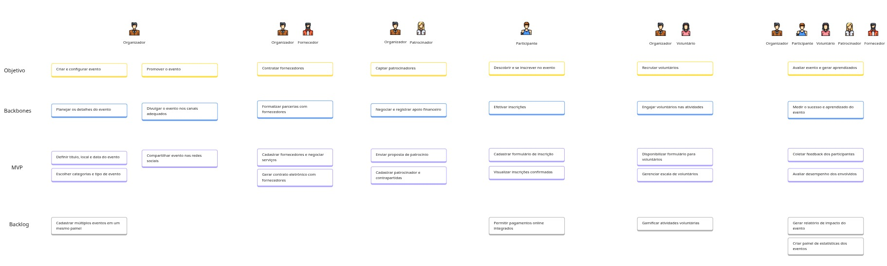

# Exercício de Construção de User Story Mapping (USM)

## Contexto

A **ComunEventos** é uma startup fictícia que visa criar uma plataforma digital para facilitar a organização e participação em eventos comunitários. Observando problemas como:

* Fragmentação de ferramentas
* Baixa integração
* Custo elevado de soluções especializadas
* Dificuldade de engajamento

A proposta é oferecer uma solução unificada e acessível, com foco em **organização, comunicação, gestão e colaboração**.

<iframe width="100%" height="600" src="https://miro.com/app/board/uXjVInpxAh0=/?share_link_id=75548130607" frameborder="0" scrolling="no" allow="fullscreen; clipboard-read; clipboard-write" allowfullscreen></iframe>

---

[Abrir PDF](arquivos/KanbanFramework.pdf)

---

## Resumo do Produto

### a) O quê?

A **plataforma ComunEventos** é um sistema online para **organizar, promover, participar e colaborar** em eventos comunitários.

**Funcionalidades principais:**

* Gestão de inscrições
* Comunicação com participantes
* Integração de patrocinadores e voluntários
* Contratação de fornecedores
* Acompanhamento de feedback

### b) Por quê?

Porque a organização de eventos comunitários é hoje **fragmentada e ineficiente**, dependendo de ferramentas desconectadas. A ComunEventos propõe:

* Integração em um só lugar
* Redução de custos
* Facilidade de engajamento
* Fortalecimento do impacto social

### c) Quem?

**Personas identificadas:**

* Organizador do Evento
* Participante
* Fornecedor Local
* Patrocinador
* Voluntário

---

## Identificação dos Atores (Personas)

| Persona      | Descrição                                       | Necessidades                                                             |
| ------------ | ----------------------------------------------- | ------------------------------------------------------------------------ |
| Organizador  | Planeja e executa os eventos                    | Promoção, gestão de inscrições, comunicação e relatórios                 |
| Participante | Interessado nos eventos                         | Informações claras, inscrição simples, notificações e interação          |
| Fornecedor   | Presta serviços (alimentação, som, espaço etc.) | Comunicação clara, contrato, cronograma, pagamento e feedback pós-evento |
| Patrocinador | Financia o evento por exposição da marca        | Visibilidade, relatórios de retorno e resultados                         |
| Voluntário   | Ajuda nas atividades do evento                  | Tarefas claras, capacitação, reconhecimento e boa comunicação            |

---

## Atividades (Etapas da Jornada do Usuário)

| ID   | Descrição                           | Usuário(s) Envolvido(s)   |
| ---- | ----------------------------------- | ------------------------- |
| At01 | Criar e configurar evento           | Organizador               |
| At02 | Promover o evento                   | Organizador               |
| At03 | Contratar fornecedores              | Organizador, Fornecedor   |
| At04 | Captar patrocinadores               | Organizador, Patrocinador |
| At05 | Descobrir e se inscrever no evento  | Participante              |
| At06 | Recrutar voluntários                | Organizador, Voluntário   |
| At07 | Avaliar evento e gerar aprendizados | Organizador, Participante, Voluntário, Patrocinador, Fornecedor |

---

## Backbone (Épicos Principais por Atividade)

| ID   | Descrição                                 | Atividade Relacionada |
| ---- | ------------------------------------------ | --------------------- |
| Bb01 | Planejar os detalhes do evento             | At01                  |
| Bb02 | Divulgar o evento nos canais adequados     | At02                  |
| Bb03 | Formalizar parcerias com fornecedores      | At03                  |
| Bb04 | Negociar e registrar apoio financeiro      | At04                  |
| Bb05 | Efetivar inscrições                        | At05                  |
| Bb06 | Engajar voluntários nas atividades         | At06                  |
| Bb07 | Medir o sucesso e aprendizado do evento    | At07                  |

---

## MVP – Histórias de Usuário por Backbone

| ID    | Backbone                                     | História de Usuário |
|-------|----------------------------------------------|----------------------|
| Ta01  | Bb01 – Planejar os detalhes do evento        | Como um organizador de eventos, eu quero definir o título, local e data do evento para que os participantes tenham as informações essenciais para se programarem e o evento possa ser devidamente divulgado. |
| Ta02  | Bb01 – Planejar os detalhes do evento        | Como um organizador de eventos, eu quero selecionar as categorias e o tipo do evento para que o evento seja classificado corretamente, facilitando a busca e a filtragem por parte dos usuários interessados. |
| —     | Bb01 – Planejar os detalhes do evento        | Como um organizador de eventos, eu quero cadastrar e gerenciar múltiplos eventos em um único painel para que eu possa otimizar meu tempo e ter uma visão centralizada de todas as minhas iniciativas. |
| —     | Bb02 – Divulgar o evento nos canais adequados| Como um organizador de eventos, eu quero compartilhar o evento nas redes sociais para que eu possa alcançar um público mais amplo e aumentar a visibilidade e o engajamento com o evento. |
| —     | Bb02 – Divulgar o evento nos canais adequados| Como um organizador de eventos, eu quero cadastrar fornecedores e negociar serviços para que eu possa organizar todos os aspectos do evento e garantir a qualidade e a disponibilidade dos recursos necessários. |
| —     | Bb02 – Divulgar o evento nos canais adequados| Como um organizador de eventos, eu quero gerar contratos eletrônicos com fornecedores para que eu possa formalizar as parcerias de forma ágil e segura, garantindo a conformidade legal. |
| —     | Bb04 – Negociar e registrar apoio financeiro | Como um organizador de eventos, eu quero enviar propostas de patrocínio para que eu possa obter apoio financeiro e viabilizar a realização do evento com os recursos necessários. |
| —     | Bb04 – Negociar e registrar apoio financeiro | Como um organizador de eventos, eu quero cadastrar patrocinadores e suas respectivas contrapartidas para que eu possa gerenciar os acordos de patrocínio e garantir o cumprimento das obrigações de ambas as partes. |
| —     | Bb05 – Efetivar inscrições                   | Como um organizador de eventos, eu quero cadastrar um formulário de inscrição personalizado para que eu possa coletar as informações necessárias dos participantes e gerenciar as inscrições de forma eficiente. |
| —     | Bb05 – Efetivar inscrições                   | Como um organizador de eventos, eu quero visualizar as inscrições confirmadas para que eu possa acompanhar o número de participantes, ter controle sobre a lista de presença e planejar a logística do evento. |
| —     | Bb05 – Efetivar inscrições                   | Como um participante, eu quero realizar o pagamento da inscrição online de forma integrada para que eu possa garantir minha vaga no evento de forma rápida, segura e conveniente. |
| —     | Bb06 – Engajar voluntários nas atividades    | Como um organizador de eventos, eu quero disponibilizar um formulário para voluntários para que eu possa recrutar e gerenciar a equipe de apoio do evento de forma organizada. |
| —     | Bb06 – Engajar voluntários nas atividades    | Como um organizador de eventos, eu quero gerenciar a escala de voluntários para que eu possa organizar as tarefas e horários da equipe de apoio de forma eficiente e garantir a cobertura de todas as atividades. |
| —     | Bb06 – Engajar voluntários nas atividades    | Como um organizador de eventos, eu quero gamificar as atividades voluntárias para que eu possa engajar e motivar os voluntários, incentivando sua participação contínua e o bom desempenho. |
| —     | Bb07 – Medir o sucesso e aprendizado do evento| Como um organizador de eventos, eu quero coletar feedback dos participantes para que eu possa avaliar a satisfação geral, identificar pontos de melhoria e aprimorar futuros eventos. |
| —     | Bb07 – Medir o sucesso e aprendizado do evento| Como um organizador de eventos, eu quero avaliar o desempenho dos envolvidos (fornecedores, voluntários, etc.) para que eu possa garantir a qualidade dos serviços e identificar parceiros de confiança para eventos futuros. |
| —     | Bb07 – Medir o sucesso e aprendizado do evento| Como um organizador de eventos, eu quero gerar um relatório de impacto do evento para que eu possa analisar os resultados, apresentar os dados de sucesso para stakeholders e justificar investimentos futuros. |
| —     | Bb07 – Medir o sucesso e aprendizado do evento| Como um organizador de eventos, eu quero criar um painel de estatísticas dos eventos para que eu possa visualizar métricas e indicadores de sucesso de forma clara e objetiva, facilitando a tomada de decisões. |

---
## Critérios de aceitação

| ID    | Backbone                                     | História de Usuário | Critérios de Aceitação |
|-------|----------------------------------------------|----------------------|-------------------------|
| Ta01  | Bb01 – Planejar os detalhes do evento        | Como um organizador de eventos, eu quero definir o título, local e data do evento para que os participantes tenham as informações essenciais para se programarem e o evento possa ser devidamente divulgado. | - Deve ser possível preencher e salvar o nome, a data, o horário e o local do evento no painel de criação. - Os dados salvos devem ser associados ao evento e permitir edição posterior. |
| Ta02  | Bb01 – Planejar os detalhes do evento        | Como um organizador de eventos, eu quero selecionar as categorias e o tipo do evento para que o evento seja classificado corretamente, facilitando a busca e a filtragem por parte dos usuários interessados. | - O organizador deve poder selecionar o tipo (ex: cultural, esportivo, beneficente) e categorias relacionadas. - As categorias selecionadas devem ser armazenadas para futura filtragem na busca por eventos. |
| —     | Bb01 – Planejar os detalhes do evento        | Como um organizador de eventos, eu quero cadastrar e gerenciar múltiplos eventos em um único painel para que eu possa otimizar meu tempo e ter uma visão centralizada de todas as minhas iniciativas. | - O organizador pode criar e gerenciar vários eventos simultaneamente em um único painel de controle. |
| —     | Bb02 – Divulgar o evento nos canais adequados| Como um organizador de eventos, eu quero compartilhar o evento nas redes sociais para que eu possa alcançar um público mais amplo e aumentar a visibilidade e o engajamento com o evento. | - Geração de links de divulgação e prévias com imagem e descrição. - Botão de compartilhamento para WhatsApp, Instagram e Facebook. |
| —     | Bb02 – Divulgar o evento nos canais adequados| Como um organizador de eventos, eu quero cadastrar fornecedores e negociar serviços para que eu possa organizar todos os aspectos do evento e garantir a qualidade e a disponibilidade dos recursos necessários. | - Deve ser possível adicionar fornecedores com dados de contato e serviços oferecidos. - O sistema deve permitir registrar o status das negociações e salvar observações. |
| —     | Bb02 – Divulgar o evento nos canais adequados| Como um organizador de eventos, eu quero gerar contratos eletrônicos com fornecedores para que eu possa formalizar as parcerias de forma ágil e segura, garantindo a conformidade legal. | - O organizador deve poder gerar um contrato padrão para o fornecedor com os dados do evento. - O fornecedor deve poder assinar digitalmente e o contrato deve ser salvo e vinculado ao evento. |
| —     | Bb04 – Negociar e registrar apoio financeiro | Como um organizador de eventos, eu quero enviar propostas de patrocínio para que eu possa obter apoio financeiro e viabilizar a realização do evento com os recursos necessários. | - O organizador deve poder gerar um documento de proposta a partir de um modelo. - A proposta deve poder ser enviada por e-mail diretamente pelo sistema. |
| —     | Bb04 – Negociar e registrar apoio financeiro | Como um organizador de eventos, eu quero cadastrar patrocinadores e suas respectivas contrapartidas para que eu possa gerenciar os acordos de patrocínio e garantir o cumprimento das obrigações de ambas as partes. | - Ao aceitar a proposta, o patrocinador é registrado no sistema com logotipo e valor investido. - Contrapartidas (ex: exibição de marca, brindes) devem ser listadas e vinculadas ao patrocinador. |
| —     | Bb05 – Efetivar inscrições                   | Como um organizador de eventos, eu quero cadastrar um formulário de inscrição personalizado para que eu possa coletar as informações necessárias dos participantes e gerenciar as inscrições de forma eficiente. | - O organizador deve poder criar um formulário com campos personalizados (nome, e-mail, preferências etc.). - O formulário deve ser vinculado ao evento e acessível publicamente para inscrições. |
| —     | Bb05 – Efetivar inscrições                   | Como um organizador de eventos, eu quero visualizar as inscrições confirmadas para que eu possa acompanhar o número de participantes, ter controle sobre a lista de presença e planejar a logística do evento. | - O organizador deve poder acessar uma lista com os inscritos e seus dados. - A lista deve poder ser exportada e atualizada em tempo real. |
| —     | Bb05 – Efetivar inscrições                   | Como um participante, eu quero realizar o pagamento da inscrição online de forma integrada para que eu possa garantir minha vaga no evento de forma rápida, segura e conveniente. | - O participante pode realizar o pagamento da inscrição diretamente pela plataforma, de forma segura e integrada. |
| —     | Bb06 – Engajar voluntários nas atividades    | Como um organizador de eventos, eu quero disponibilizar um formulário para voluntários para que eu possa recrutar e gerenciar a equipe de apoio do evento de forma organizada. | - Publicação de formulário com campos específicos. - Confirmação automática após inscrição. |
| —     | Bb06 – Engajar voluntários nas atividades    | Como um organizador de eventos, eu quero gerenciar a escala de voluntários para que eu possa organizar as tarefas e horários da equipe de apoio de forma eficiente e garantir a cobertura de todas as atividades. | - Criação de escala de tarefas e horários. - Alocação automática ou manual com notificações. |
| —     | Bb06 – Engajar voluntários nas atividades    | Como um organizador de eventos, eu quero gamificar as atividades voluntárias para que eu possa engajar e motivar os voluntários, incentivando sua participação contínua e o bom desempenho. | - Implementar sistema de pontos, medalhas ou recompensas para engajamento dos voluntários. |
| —     | Bb07 – Medir o sucesso e aprendizado do evento| Como um organizador de eventos, eu quero coletar feedback dos participantes para que eu possa avaliar a satisfação geral, identificar pontos de melhoria e aprimorar futuros eventos. | - Envio de formulário de avaliação com campos personalizáveis. - Armazenamento das respostas para análise. |
| —     | Bb07 – Medir o sucesso e aprendizado do evento| Como um organizador de eventos, eu quero avaliar o desempenho dos envolvidos (fornecedores, voluntários, etc.) para que eu possa garantir a qualidade dos serviços e identificar parceiros de confiança para eventos futuros. | - Avaliação por critérios definidos (pontualidade, qualidade etc.) para fornecedores, voluntários e demais participantes. - Registro das avaliações vinculadas ao evento. |
| —     | Bb07 – Medir o sucesso e aprendizado do evento| Como um organizador de eventos, eu quero gerar um relatório de impacto do evento para que eu possa analisar os resultados, apresentar os dados de sucesso para stakeholders e justificar investimentos futuros. | - Geração automática de relatório com dados quantitativos e qualitativos do evento. |
| —     | Bb07 – Medir o sucesso e aprendizado do evento| Como um organizador de eventos, eu quero criar um painel de estatísticas dos eventos para que eu possa visualizar métricas e indicadores de sucesso de forma clara e objetiva, facilitando a tomada de decisões. | - Visualização de métricas e indicadores de sucesso dos eventos realizados. |

---

## Backlog Futuro

| ID   | Descrição                                      | Backbone |
| ---- | ---------------------------------------------- | -------- |
| Ta14 | Cadastrar múltiplos eventos em um mesmo painel | Bb01     |
| Ta15 | Permitir pagamentos online integrados          | Bb05     |
| Ta16 | Gamificar atividades voluntárias               | Bb06     |
| Ta17 | Gerar relatório de impacto do evento           | Bb07     |
| Ta18 | Criar painel de estatísticas dos eventos       | Bb07     |

---

## Tarefas em Histórias de Usuário

### **Backbone: Bb01 – Planejar os detalhes do evento**

**Definir título, local e data do evento**

* Deve ser possível preencher e salvar o nome, a data, o horário e o local do evento no painel de criação.
* Os dados salvos devem ser associados ao evento e permitir edição posterior.

**Escolher categorias e tipo de evento**

* O organizador deve poder selecionar o tipo (ex: cultural, esportivo, beneficente) e categorias relacionadas.
* As categorias selecionadas devem ser armazenadas para futura filtragem na busca por eventos.

**Cadastrar múltiplos eventos em um mesmo painel**

* O organizador pode criar e gerenciar vários eventos simultaneamente em um único painel de controle.

---

### **Backbone: Bb02 – Divulgar o evento nos canais adequados**

**Compartilhar evento nas redes sociais**

* Geração de links de divulgação e prévias com imagem e descrição.
* Botão de compartilhamento para WhatsApp, Instagram e Facebook.

---

### **Backbone: Bb03 – Formalizar parcerias com fornecedores**

**Cadastrar fornecedores e negociar serviços**

* Deve ser possível adicionar fornecedores com dados de contato e serviços oferecidos.
* O sistema deve permitir registrar o status das negociações e salvar observações.

**Gerar contrato eletrônico com fornecedores**

* O organizador deve poder gerar um contrato padrão para o fornecedor com os dados do evento.
* O fornecedor deve poder assinar digitalmente e o contrato deve ser salvo e vinculado ao evento.

---

### **Backbone: Bb04 – Negociar e registrar apoio financeiro**

**Enviar proposta de patrocínio**

* O organizador deve poder gerar um documento de proposta a partir de um modelo.
* A proposta deve poder ser enviada por e-mail diretamente pelo sistema.

**Cadastrar patrocinador e contrapartidas**

* Ao aceitar a proposta, o patrocinador é registrado no sistema com logotipo e valor investido.
* Contrapartidas (ex: exibição de marca, brindes) devem ser listadas e vinculadas ao patrocinador.

---

### **Backbone: Bb05 – Efetivar inscrições**

**Cadastrar formulário de inscrição**

* O organizador deve poder criar um formulário com campos personalizados (nome, e-mail, preferências etc.).
* O formulário deve ser vinculado ao evento e acessível publicamente para inscrições.

**Visualizar inscrições confirmadas**

* O organizador deve poder acessar uma lista com os inscritos e seus dados.
* A lista deve poder ser exportada e atualizada em tempo real.

**Permitir pagamentos online integrados**

* O participante pode realizar o pagamento da inscrição diretamente pela plataforma, de forma segura e integrada.

---

### **Backbone: Bb06 – Engajar voluntários nas atividades**

**Disponibilizar formulário para voluntários**

* Publicação de formulário com campos específicos.
* Confirmação automática após inscrição.

**Gerenciar escala de voluntários**

* Criação de escala de tarefas e horários.
* Alocação automática ou manual com notificações.

**Gamificar atividades voluntárias**

* Implementar sistema de pontos, medalhas ou recompensas para engajamento dos voluntários.

---

### **Backbone: Bb07 – Medir o sucesso e aprendizado do evento**

**Coletar feedback dos participantes**

* Envio de formulário de avaliação com campos personalizáveis.
* Armazenamento das respostas para análise.

**Avaliar desempenho dos envolvidos**

* Avaliação por critérios definidos (pontualidade, qualidade etc.) para fornecedores, voluntários e demais participantes.
* Registro das avaliações vinculadas ao evento.

**Gerar relatório de impacto do evento**

* Geração automática de relatório com dados quantitativos e qualitativos do evento.

**Criar painel de estatísticas dos eventos**

* Visualização de métricas e indicadores de sucesso dos eventos realizados.

---
